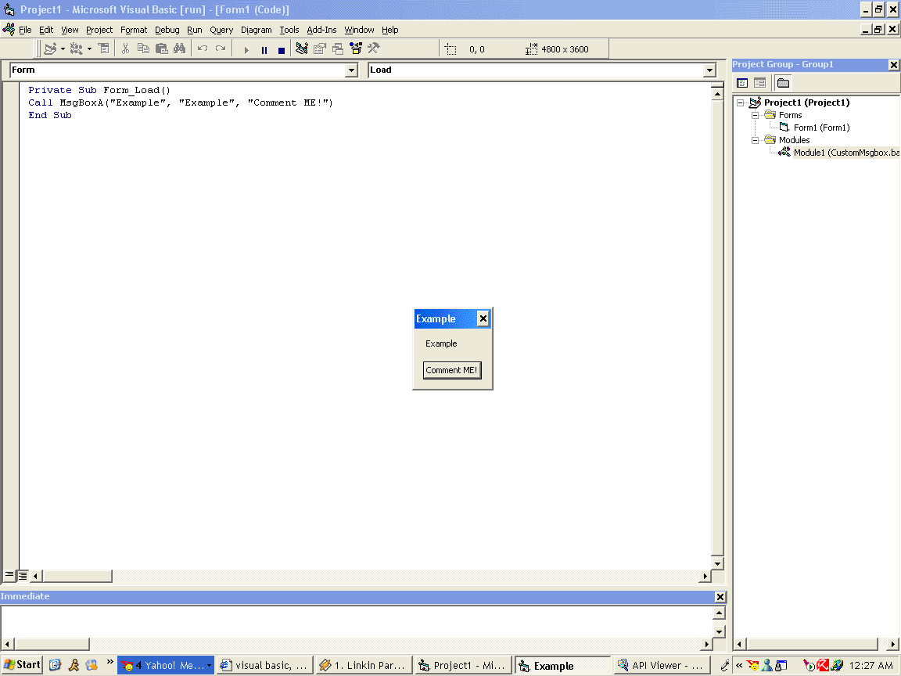



## CustomMsgbox, all buttons and icon support\.

### Description

Model and project for a real custom msgbox unlike using a form, it hooks.
 
### More Info
 

             |
---                |---
**Submitted On**   |2004-06-06 13:42:14
**By**             |[\*Unknown\*](https://github.com/Planet-Source-Code/PSCIndex/blob/master/ByAuthor/unknown.md)
**Level**          |Advanced
**User Rating**    |4.3 (13 globes from 3 users)
**Compatibility**  |VB 6\.0
**Category**       |[Coding Standards](https://github.com/Planet-Source-Code/PSCIndex/blob/master/ByCategory/coding-standards__1-43.md)
**World**          |[Visual Basic](https://github.com/Planet-Source-Code/PSCIndex/blob/master/ByWorld/visual-basic.md)
**Archive File**   |[CustomMsgb175449662004\.zip](https://github.com/Planet-Source-Code/unknown-custommsgbox-all-buttons-and-icon-support__1-54215/archive/master.zip)

